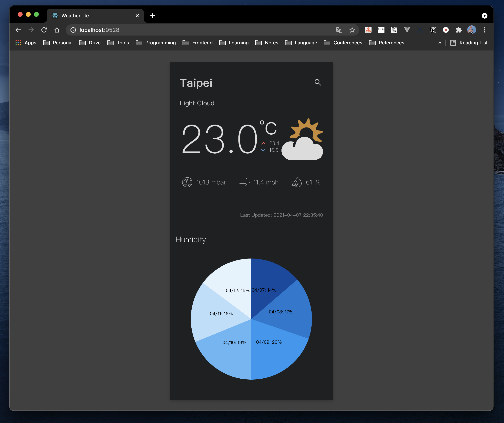

# WeatherLite



This repository is a simple weather widget implemented in React with TypeScript. For now, you can view some weather information by searching different city, also you can see some simple charts of minimum maximum temperature (bar chart) and humidity (pie chart), which are redered without using UI component library, via clicking the icon on the widget. :tada:

> HINT: If you have any questions, please feel free to ask me.

---

## Description

### Excecution

1. To run our production, you need to clone our project first
  ```bash
  $ git clone https://github.com/yungshenglu/WeatherLite/
  ```
2. After cloning, change the your current directory into the repository and setup the project
  ```bash
  $ cd WeatherLite/ & yarn install
  ```
  - The command yarn install will install some necessary packages for this project
  - It will take few second for running above command
3. Compiles and hot-reloads for development
  ```bash
  $ yarn start
  ```
  - It will take few second for running above command
  - This command will also start a proxy server on port `9527` to fetch the data from [MetaWeather](https://www.metaweather.com/api/)
  - You won't get any error messages if running successful
4. Congratulation! you can open your browser to `http://localhost:9528` and see our **WeatherLite**

---

## Implementation

### CORS (Cross-Origin Resource Sharing)

> HINT: [CORS on Wiki](https://en.wikipedia.org/wiki/Cross-origin_resource_sharing)

- Implementing a simple **Proxy server** to solve the CORS policy
  - Set the proxy server running on port `9527` via [Express](https://expressjs.com/)
  - You can see the detail of the implementation [here](./app.js)
- The default of the request mode in Express server is `mode: no-cors`
  - Use [CORS](https://www.npmjs.com/package/cors), a Node package for providing a Connect/Express middleware that can be used to enable CORS with various options.
  - You can see the detail of the implementation [here](./app.js)
- In this repository, we only implement the following two APIs in our server: (The detial is in the following **APIs** section)
  - `/api/posts&before=:before`: Fetch the list of the posts
  - `api/post&id=:id`: Fetch the content of the post via post's ID

### Customize Hooks

> HINT: You can see the detail [here](./src/hooks)

- `useLocation`: Fetch the WOEID of this query
  - To fetch the weather data, we need to get the WOEID (Where On Earth ID) first
  - When entering the page first time, the default parameter is set to "Taipei"
- `useWeather`: Fetch the weather data via WOEID
  - To fetch the weather data, we need the WOEID fetching in previous hook
  - When entering the page first time, the default of the default parameter is the WOEID of "Taipei".
  - After receiving the responses, do the following:
    - Set the current temperature by `the_temp`
    - Set the current air pressure by `air_pressure`
    - Set the current wind speed by `wind_speed`
    - Set the current humidity by `humidity`
    - Collect the data of humidity in the applicable dates
    - Collect the minimum temperature in the applicable dates
    - Collect the maximum temperature in the applicable dates

### Implement Charts

- **Bar Chart**
  - The component of bar chart is implemented in [here](./src/components/CusBarChart), which is composed with [`CusBarGroup`](./src/components/CusBarGroup)
  - Each bar in the chart is the component `CusBarGroup` which is implemented in `<rect>`
  - Besides, each bar also has the label and the value implemented in `<text>`
- **Pie Chart**
  - The component of pie chart is implemented in [here](./src/components/CusPieChart), which is composed with [`CusPieSlice`](./src/component/CusPieSlice)
  - Each slice in the chart is the component `CusPieSlice` which is implemented in `<path>`
  - The curve and the radius of `<path>` which is implemented using trigonometric function (i.e., sine and cosine)
  - Besides, each slice also has the label and the value implemented in `<text>`

---
## APIs

> **HINT:** See more of APIs [here](https://www.metaweather.com/api/)

- GET: `/api/woeid=:query`
  - Usage: Fetch the WOEID of this query
  - Params:
    - `query` (String):
      - Return the WOEID of this query
  - URL:
    - `https://www.metaweather.com/api/location/search/?query=${query}`
- GET: `/api/location=:woeid`
  - Usage: Fetch the weather data via WOEID
  - Params:
    - `woeid` (Number):
      - Return the weather data of this WOEID
  - URL:
    - `https://www.metaweather.com/api/location/${woeid}`

---

## Contributor

> NOTICE: You can follow the contributing process [CONTRIBUTING.md](CONTRIBUTING.md) to join me. I am very welcome for any issue!

- [David Lu](https://github.com/yungshenglu)

---

## License

[WTFPL](LICENSE)
